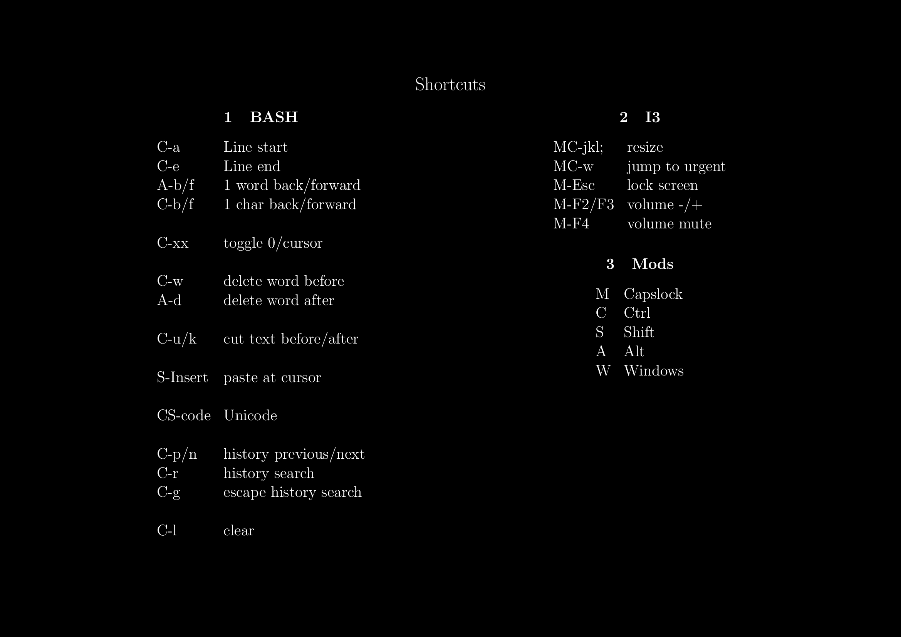

# Cheatsheet
The purpose of repo is to create a a4 landscape document of shortcuts I'm currently trying to memorize.
It can directly generate a PNG/JPG to use as an background image e.g. in i3.

See make file for setup via `feh`, should work by just running `make` directly.

## Dependencies

- latex
- imagemagick for the conversion command
